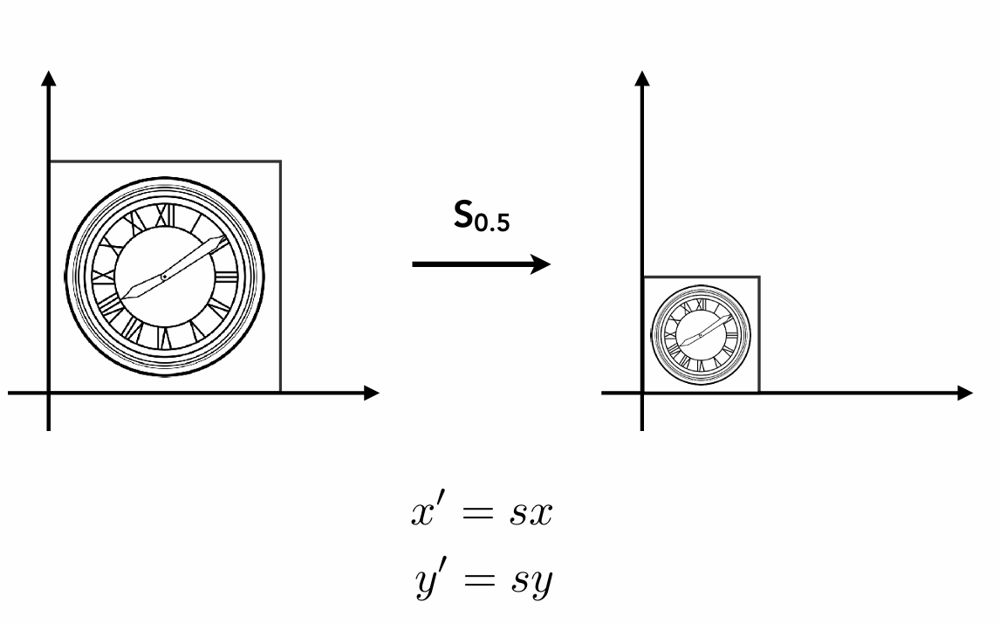
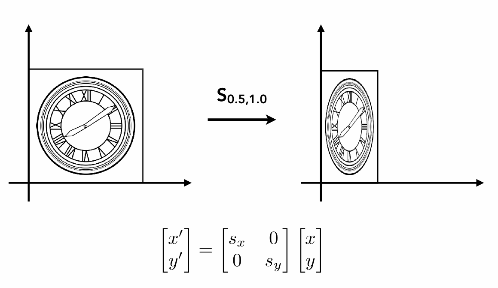
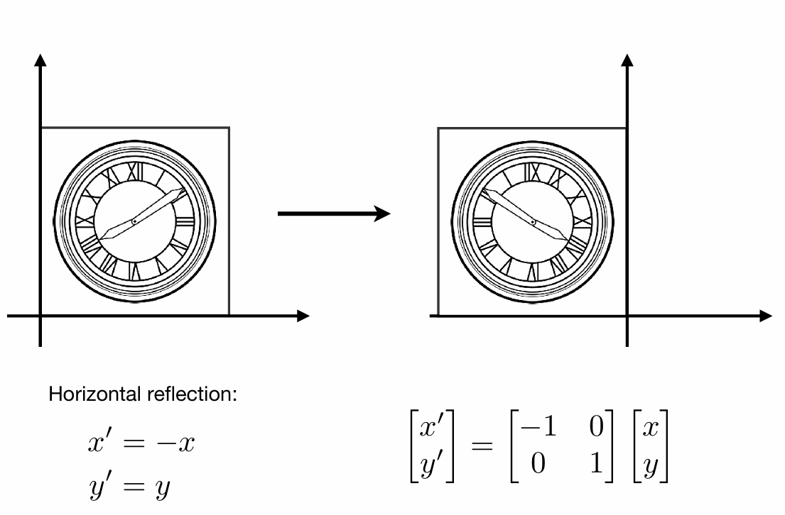
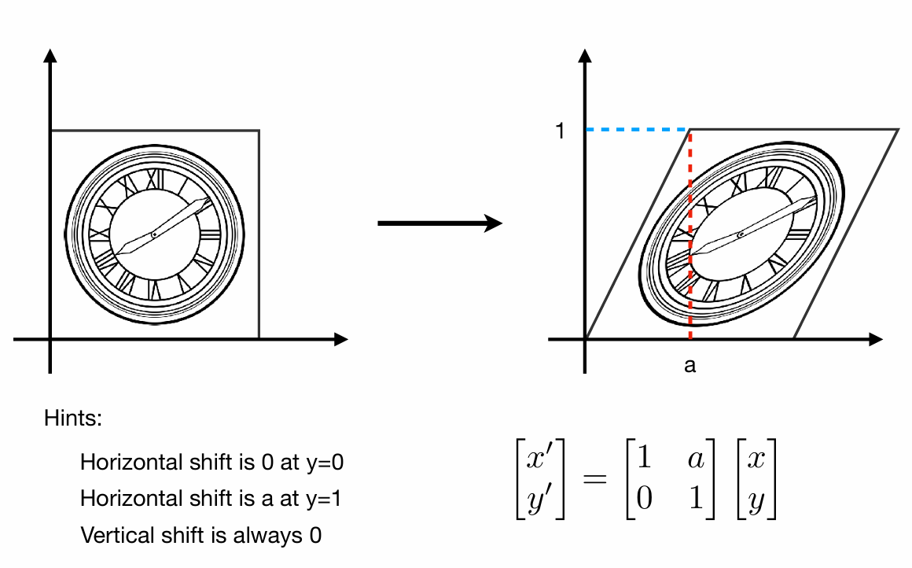
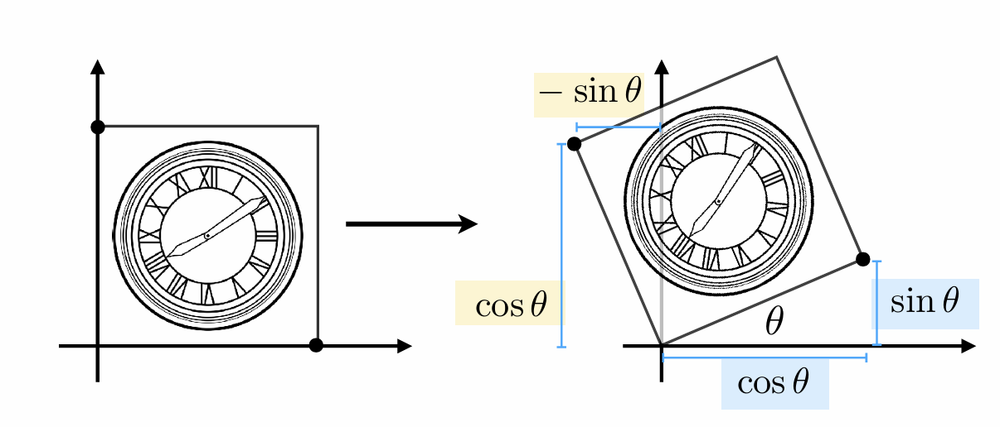
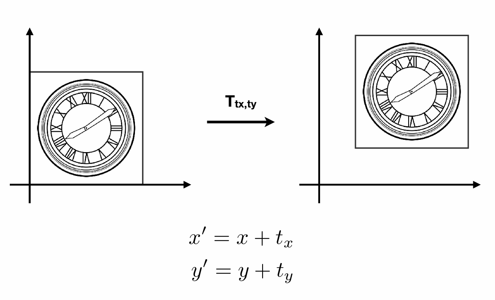
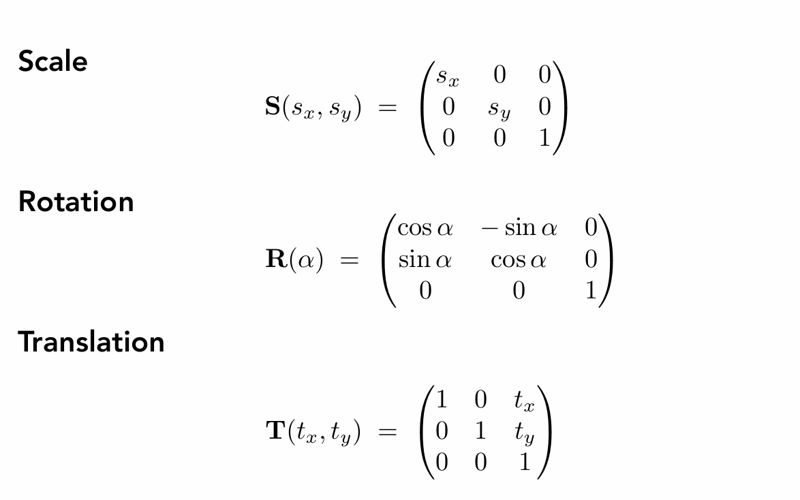

# 变换 Transformation
---

你应该具备的基础知识：
- Vectors-什么是向量及其基础运算
- Dot Product-点乘
- Cross Product-叉乘
- Matrices-矩阵

---

变换在计算机图形学中扮演着重要的角色。它可以应用于二维和三维图形，通过平移、旋转、缩放和投影等操作把一个对象从一个位置、尺寸或方向转换到另一个。通过变换，我们可以创建出各种复杂的图形效果，如动画、变形和透视等。变换还可以用于相机视图的调整，以及在三维场景中实现物体的移动、旋转和缩放等操作。

## 二维变换
让我们先从简单的二维变换开始

#### **缩放（以原点为中心）**

可以用矩阵表示为：

对于不同比例的缩放：

同样的可以推出**翻转**：

对于这种**切变**：

如果我们有一个点P`(x, y)`，应用上面的切变变换后，它的y坐标始终不变，只有x在水平方向上发生变化；而且当y=0时，水平方向上的变化为0，y=1时，水平方向上的变化为a。我们可以取`(0,1) -> (a,1)`这一点的变换来推出矩阵：
$$
\begin{cases} 
		x' = a = 0 + 1*a \\
		y' = y = 1 
\end{cases}
$$
你可以试试其他点，都符合这个规律。

其中矩阵的第一行表示x轴方向上的变换，第二行表示y轴方向上的变换。切变矩阵中的元素s表示在x轴方向上的切变比例。当s为正值时，表示向右上方切变；当s为负值时，表示向左上方切变。

#### 接下来是重头戏：**旋转（以原点为中心）**

我们还是取特殊点：`(1,0)`、`(0,1)`的变化来推导
对于`(1,0)`点，它在旋转 θ 角后变成了`(cosθ,sinθ)`：
$$
\begin{cases} 
		x' = 1 * cosθ + 0 * unknown \\
		y' = 1 * sinθ + 0 * unknown 
\end{cases}
$$
写成矩阵就是：

$$
    \begin{bmatrix}
    x' \\
    y'
    \end{bmatrix}
    =
    \begin{bmatrix}
    cosθ & unknown \\
    sinθ & unknown 
    \end{bmatrix}
    \cdot
    \begin{bmatrix}
    x \\
    y
    \end{bmatrix}
$$

而对于`(0,1)`点，它在旋转 θ 角后变成了`(-sinθ,cosθ)`：

$$
\begin{cases} 
		x' = 0 * unknown + 1 * (-sinθ) \\
		y' = 0 * unknown + 1 * cosθ
\end{cases}
$$
写成矩阵就是：
$$
    \begin{bmatrix}
    x' \\
    y'
    \end{bmatrix}
    =
    \begin{bmatrix}
    unknown & -sinθ \\
    unknown &  cosθ 
    \end{bmatrix}
    \cdot
    \begin{bmatrix}
    x \\
    y
    \end{bmatrix}
$$

把他们合并起来：
$$
    \begin{bmatrix}
    x' \\
    y'
    \end{bmatrix}
    =
    \begin{bmatrix}
    cosθ & -sinθ \\
    sinθ &  cosθ 
    \end{bmatrix}
    \cdot
    \begin{bmatrix}
    x \\
    y
    \end{bmatrix}
$$
所以旋转矩阵就是：

#### 有旋转就有**平移**：

看起来很容易不是吗？
但是如果一个物体既会旋转又要平移，该怎么表示？

平移变换无法用矩阵相乘的形式表示出来，所以我们不得不采用上面这种方式来表示它。

但是这太不优雅了！而且，我们也不希望平移成为一种特例，这样对计算机和人来说，表示和计算起来都十分麻烦。有没有一种统一的方式，能够让我们来表示所有的转换？
让我们转变思路，进行“升维打击”：
#### 齐次坐标系
齐次坐标系（Homogeneous Coordinates）是一种在计算机图形学和计算机视觉中常用的表示点、向量和变换的方法。通过引入一个额外的维度，我们能够让点和向量可以用更简洁的方式表示，并且能够方便地进行坐标变换。

对二维坐标系来说，一个点通常由其 x、y 表示。但是，在齐次坐标系中，我们增加一个第三维度：
- 对于二维点，我们将其表示为
$$
 (x, y, 1)^T
$$
- 对于二维向量，我们将其表示为
$$
 (x, y, 0)^T
$$

为什么要这样做？
想一想点和向量的运算：
$$
\begin{cases} 
		vector + vector = vector & (0+0=0)\\
        point + vector = point & (1+0=1)\\
		point - point  = vector & (1-1=0)
\end{cases}
$$
在齐次坐标系下，

$$
    点
    \begin{bmatrix}
        x \\
        y \\
        w
    \end{bmatrix}
    ，就是点
    \begin{bmatrix}
        x / w \\
        y / w \\
        1
    \end{bmatrix}(w \neq 0)
$$

对于`point+point`这种情况：
$$
    \begin{bmatrix}
    x_1 \\
    y_1 \\
    1
    \end{bmatrix}
    +
    \begin{bmatrix}
    x_2 \\
    y_2 \\
    1
    \end{bmatrix}
    =
    \begin{bmatrix}
    x_1 + x_2 \\
    y_1 + y_2 \\
    2
    \end{bmatrix}
    = 
    \begin{bmatrix}
    (x_1 + x_2) / 2 \\
    (y_1 + y_2) / 2 \\
    1
    \end{bmatrix}
    = Point
$$
说了这么多，这次我们回头再看之前的变换，就可以用一个统一的线性变换表示出来：

这样二维空间下的坐标变换就可以用一种统一的方式来表示了

