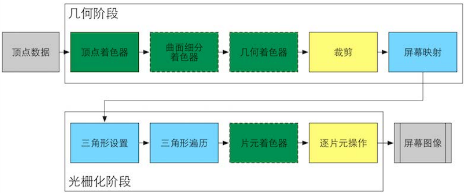
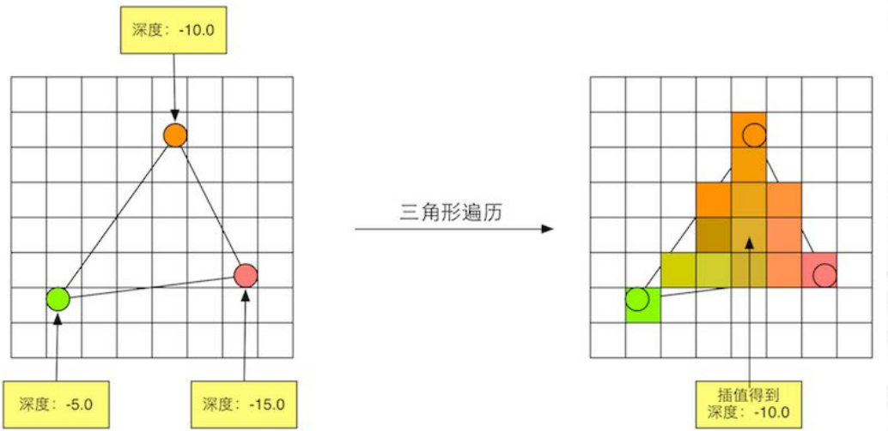
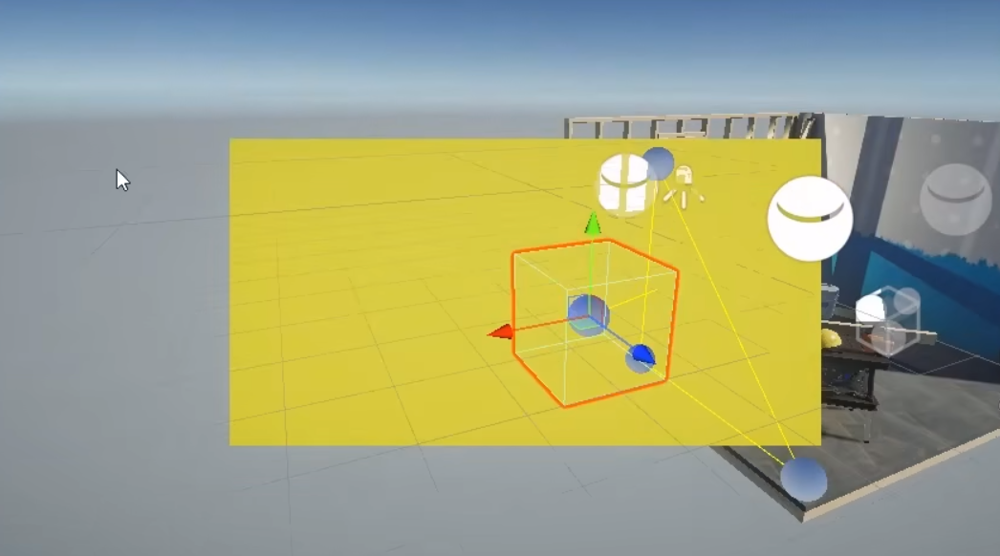
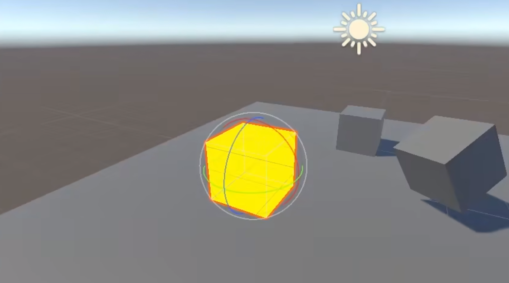

# 计算机图形学——渲染的奇妙世界（持续更新）
>
> 一份 Unity shader 入门教程
>
## 写在前面

#### 编程与绘画——这是满足创造事物的纯粹快乐中最易于驾驭的介质

想象一下，你正在用魔法笔刷描绘一个全新的世界——从闪闪发光的水面到巍峨的山脉，从炫目的光影效果到逼真的角色动画。你将成为这个世界的创造者。而这一切，都始于你手中的代码和那些看似复杂却充满魅力的Shader。

在图形学的世界里，数学公式变成了你的魔法咒语，行行代码变成了你的画笔。一切都是如此鲜活而富有创意，仿佛每个像素都在向你讲述一个新的故事。

你是否曾经好奇过那些精美的游戏画面背后的秘密？是否想要亲手制作出如电影般绚丽的视觉效果？在这里，我们一步步揭开这些谜团，从最基础的概念走向高深的技术，从简单的图形绘制到复杂的光影效果。

我们将使用Unity这个工具，一起编写顶点着色器，探索片段着色器。你会学到如何让光线在场景中跳跃、反射，如何让水面泛起涟漪，如何让虚拟角色真的身处虚拟。每一个Shader，都是你创意的延伸；每一次渲染，都是你智慧的结晶。

#### 准备工作：你需要具备什么基础？

当然了，在踏上这段令人兴奋的旅程之前，你会需要一些基础知识。

- 你需要具备一定的**编程基础**，最好是C++或Python。这些语言将帮助你理解计算机图形学中的基本概念和实现方式。
- 计算机图形学离不开数学。你需要对**线性代数**（向量和矩阵）、几何学以及基础的微积分有基本的了解。这些数学知识是实现各种图形变换和光照计算的基石。
- 最重要的是，你需要有**自学能力**。你不能指望通过一本“百科全书”就学会所有的知识，你需要自己搜索、解决问题，你可以在B站、Youtube和Google上找到99%的问题的答案。

最后：给自己一个目标吧！你想渲染出什么样的画面？朝着这个方向努力吧！

---

## 第一节 你需要知道的：渲染管线

在开始一切学习之前，我们有必要了解渲染的基本工具：Shader(着色器)。与之关系非常紧密的就是渲染管线(Rendering Pipeline)。如果你没有了解过渲染管线的工作流程，就永远无法说自己对 Shader 已经入门。

#### 什么是渲染管线

一个三维模型不会自己变到相机画面里渲染出来，所以说，计算机需要从一系列的顶点数据、纹理等信息出发，把这些信息最终转换成一张人眼可以看到的图像。而渲染管线的工作任务就是由一个三维场景出发、渲染一张二维图像。CPU会提供我们要渲染的三维模型的顶点以及其他信息，所以这个工作通常是由CPU和GPU共同完成的。

一个渲染流程分成3个阶段：
应用阶段(Application Stage)、 几何阶段(Geometry Stage)、 光栅化阶段(Rasterizer Stage)。

#### 渲染管线的流程

• **应用阶段**

这一阶段最重要的输出是渲染所需的**几何信息**， 即渲染图元(rendering primitives)。 通俗来讲，渲染图元可以是点、 线、 三角面等。这些渲染图元将会被传递给下一个阶段。
在这一阶段中，我们有3个主要任务：

> - 准备好场景数据(摄像机的位置、视锥体、场景中包含了哪些模型、使用了哪些光源等等)
> - 粗粒度剔除(culling)工作: 把那些不可见的物体剔除出去
> - 设置好每个模型的渲染状态(包括但不限于它使用的材质(漫反射颜色、 高光反射颜色)、使用的纹理、使用的Shader等)

• **几何阶段**

几何阶段用于处理所有和我们要绘制的几何相关的事情。例如，决定需要绘制哪个图元，怎样绘制它们，在哪里绘制它们。这一阶段通常在 GPU 上进行。
几何阶段负责和每个渲染图元打交道，进行逐顶点、逐多边形的操作。把顶点坐标变换到屏幕空间中，再交给光栅器进行处理。通过对输入的渲染图元进行多步处理后，这一阶段将会输出屏幕空间的二维顶点坐标、每个顶点对应的深度值、着色等相关信息，并传递给下一个阶段。

• **光栅化阶段**

光栅化阶段将会使用上个阶段传递的数据来产生屏幕上的像素，并渲染出最终的图像。这段也是在 GPU 上运行。光栅化的任务主要是决定每个渲染图元中的哪些像素应该被绘制在屏幕上。它需要对上一个阶段得到的逐顶点数据 （例如纹理坐标 、顶点颜色等）进行插值，然后再进行逐像素处理。

---

#### GPU流水线

渲染管线的起点是应用阶段。简单来说，CPU会把数据加载到显存中，然后设置渲染状态，最后调用 **Draw Call** 来让GPU渲染。
当给定了一个 Draw Call 时， GPU 就会根据渲染状态（例如材质、 纹理、 着色器等）和所有输入的顶点数据来进行计算， 最终输出成屏幕上显示的那些漂亮的像素。 而这个计算过程，就是GPU 流水线。

几何阶段和光栅化阶段可以分成若干更小的流水线阶段，这些流水线阶段由 GPU 来实现，我们无法拥有绝对的控制权，但每个阶段 GPU 都提供了不同的可配置性或可编程性：


> 绿色表示该流水线阶段是完全可编程控制的

> 黄色表示该流水线阶段可以配置但不是可编程的

> 蓝色表示该流水线阶段是由 GPU 固定实现的，开发者没有任何控制权。

在这之中，**顶点着色器 (Vertex Shader)** 和 **片元着色器 (Fragment Shader)** 是我们所关注的重点，我们的大部分操作都会在这里进行，他们都是完全可编程的。

#### 几何阶段

##### 顶点着色器

主要作用是接收顶点数据，并对这些数据进行一些必要的变换和计算，以便将顶点正确地显示在屏幕上。
作为GPU流水线的第一个阶段，它的输入来自于 CPU (包括顶点的位置坐标、颜色、法线、纹理坐标等) 。顶点着色器的处理单位是顶点，也就是说，输入进来的每个顶点都会调用一次顶点着色器。顶点着色器本身不可以创建或者销毁任何顶点，而且无法得到顶点与顶点之间的关系。

顶点着色器需要完成：

- **顶点的坐标变换**
    将顶点从模型空间，即模型的局部坐标系转换到屏幕空间，我们可以在这一步中改变顶点的位置，这非常有用，例如，我们可以通过改变顶点位置来模拟水面、布料等的材质的效果
- **逐顶点光照**
  计算顶点的光照强度。这些计算结果可以传递给片元着色器，生成更真实的光照效果

顶点着色器处理完顶点之后，我们将那些不在摄像机视野内的顶点裁剪掉（这个流水线阶段是裁剪）
最后我们进行屏幕映射 (Screen Mapping)，它负责把每个图元的坐标转换到屏幕坐标系中，这个阶段是不可配置和编程的。屏幕映射得到的屏幕坐标决定了这个顶点对应屏幕上哪个像素以及距离这个像素有多远。
> 需要引起注意的地方是，屏幕坐标系在 OpenGL DirectX 之间的差异:OpenGL把屏幕的左下角当成窗口坐标系的原点，而 DirectX 则定义了屏幕的左上角为窗口坐标系的原点。

经过几何阶段的一系列处理，我们会得到屏幕坐标系下的顶点位置以及和它相关的额外信息的输出，比如深度值 （z 坐标）、法线方向、视角方向等。

#### 光栅化阶段

接下来我们就进入了 **光栅化阶段** ，光栅化阶段有两个最重要的目标：计算每个图元覆盖了哪些像素，以及为这些像素计算它们的颜色。

在计算机图形学中，我们把屏幕抽象的认为是一个二维数组，数组中的每一个元素是一个像素(Pixel)，屏幕是一个典型的光栅(Raster)成像设备。光栅化(Rasterize)就是指把东西画在屏幕上的过程。
我们在屏幕上建立一个坐标系，这样任何屏幕空间的像素点都可以用(x，y)来表示(其中x，y都是整数)


光栅化的第一个流水线阶段是三角形设置 (Triangle Setup) 。这个阶段会计算光栅化一个三角网格所需的信息。
具体来说，上一个阶段输出的都是三角网格的**顶点**，但如果要得到整个三角网格对像素的覆盖情况，我们就必须计算每条边上的**像素**坐标。
在三角形遍历 (Triangle Traversal) 阶段，我们将会检查每个像素是否被一个三角网格所覆盖。如果被覆盖的话，就会生成一个**片元 (fragment)** 。而这样一个找到哪些像素被三角网格覆盖的过程就是三角形遍历，这个阶段也被称为扫描变换 (Scan Conversion)，三角形遍历阶段会根据上个阶段的计算结果来判断一个三角网格覆盖了哪些像素，并使用三角网格3个顶点的顶点信息对整个覆盖区域的像素进行插值



前面的光栅化阶段实际上并不会影响屏幕上每个像素的颜色值，而是会产生一系列的数据信息，用来表述一个三角网格是怎样覆盖每个像素的。而每个片元就负责存储这样一系列数据。真正会对像素产生影响的阶段是下一个流水线阶段：逐片元操作 (Per-Fragment Operations)

##### 片元着色器

片元着色器的输入是上个阶段对顶点信息插值得到的结果，而它的输出是一个或者多个颜色值：


片元着色器给予了我们高度自定义的自由，可以完成很多重要或者很酷的效果(比如三渲二)，一些二次元游戏之所以有如此浓重的二次元风格，很大一部分都来自于这里的处理。

<center class="half">


</center>

---

渲染管线的最后一步：逐片元操作 (Per Fragment Operations)。
这是OpenGL中的说法，DirectX中这一阶段被称为输出合并阶段 (Output-Merger)。Merger 这个词让人明白这一步骤的目的：合并。而 OpenGL 的名字表示了这个阶段的操作单位：片元。
这一阶段决定了每个片元的可见性。这涉及了很多测试工作，如果一个片元通过了所有的测试（深度测试、模板测试等）就需要把这个片元的颜色值和已经存储在颜色缓冲区颜色进行混合。
测试的过程实际上是个很复杂的过程，能否理解这些测试过程将影响你是否可以理解渲染队列，尤其是处理透明效果时出现的问题。但现阶段我们先按下不表，你只需要了解一下大概即可。

当模型的图元经过了上而层层计算和测试后，就会显示到我们的屏幕上。我们的屏幕显示的就是颜色缓冲区中的颜色值。但是，为了避免我们看到那些正在进行光栅化的图元，GPU 会使用双重缓冲 (Double Buffering) 的策略。对场景的渲染是在幕后发生的， 即在后置缓冲(Back Buffer) 中。 一旦场景已经完全被渲染到了后置缓冲中， GPU 就会交换后置缓冲区和前置缓冲(Front Buffer) 中的内容， 而前置缓冲区是之前显示在屏幕上的图像。 这样保证了我们看到的图像总是连续的。

> 想一想：你是不是经常在游戏中看到一项设置叫做**垂直同步**？
> 垂直同步就是为了解决画面撕裂问题而产生的。如果显卡帧数高于显示器的刷新率，显卡在显示器逐行扫描完画面之前就提前绘制好了后置缓冲，此时发生了缓冲交换，显示器接着去绘制帧传递之后的前置缓冲，这就导致了画面的撕裂。而垂直同步的解决方案也很简单：让显卡等会儿

---

#### 顶点坐标转换

接下来我们回顾一下**顶点坐标转换**：把每个模型的局部坐标转换到屏幕坐标系中，这一转换过程就是顶点着色器要完成的坐标转换。

假如我们在建模软件的虚拟场景中放置了一个立方体，如何让他显示在屏幕上？

- 我们已经有的：立方体的局部顶点坐标
- 我们需要的：屏幕坐标系下的坐标
  
下面我们一步一步实现变换：

##### 模型(Model)变换

在建模软件中创建一个立方体，你会发现立方体的顶点坐标都是类似于```(0.5,0.5,0.5)```这样的相对于轴心的局部坐标，如果我们想知道两个立方体的位置关系，只知道模型的局部顶点坐标并没有什么帮助，我们需要把模型们放在统一的参考系下，也就是通过基本变换，像缩放、平移，旋转等将模型的相对父物体的局部坐标转换为世界坐标，也称为 **模型(Model)** 变换。

##### 视图(View)变换

要让模型渲染在我们的屏幕上，我们还需要知道物体与相机的关系，将物体的世界坐标转换到相机坐标系下，熟悉线性代数的你应该很容易想到，这一步我们只需让物体的变换减去相机的变换矩阵即可，我们会得到一个以相机位置为原点的相机坐标系，这一变换也就是 **视图(View)** 变换，也称为相机(Camera)变换。

<center class="half">


</center>

##### 投影(Projection)变换

我们将相机的视锥投影到一个标准立方体中，得到齐次裁剪坐标系，这样既能够将三维图形投影到二维平面上，又不会丢失深度信息，方便我们下一步进行光栅化。

<center class="half">


</center>

> 要将标准立方体变换到 ```[0, width]*[0, height]``` 的屏幕空间上，我们还要经过 视口(Viewport) 变换。如果不考虑z轴，视口变换需要经过两个步骤：先将标准立方体x轴和y轴长度分别缩放到width和height，然后进行平移变换，将标准立方体的中点从原点平移到屏幕中心。

我们把上述三个变换的整个过程总称为 **MVP变换** 。


这之中涉及一些较为复杂的矩阵运算，幸运的是，这一过程中大部分计算CPU都为我们计算好了，我们只需知道MVP矩阵如何使用即可。

---

## 第二节 初探Shader

### 什么是 OpenGL & DirectX

我们已经简单介绍了渲染的概念流水线以及 GPU 是如何实现这些流水线的。但是，如果要我们直接访问 GPU 来实现这些着色器操作，我们可能需要和各种寄存器、显存打交道，这样就太麻烦了，而图像编程接口在这些硬件的基础上进行了一层抽象，让我们不必关注底层细节，专注于实现我们的目标。

OpenGL 和 DirectX 就是这些接口，它们架起了上层应用程序和底层 GPU 的沟通桥梁。 我们编写程序向这些接口发送渲染命令，而这些接口会依次向显卡驱动发送渲染命令，这些显卡驱动把 OpenGL 或者 DirectX 的函数调用翻译成了 GPU 能够听懂的语言，同时它们也负责把纹理等数据转换成 GPU 所支持的格式。


### 什么是 HLSL、 GLSL、 CG

我们在上面讲到了很多 **可编程** 的着色器阶段，如顶点着色器、 片元着色器等。 这些着色器的可编程性在于，我们可以使用 一种特定的语言：着色语言(Shading Language)来编写程序，而不需要去学习复杂的汇编语言。

对应于图像编程接口，常见的着色语言有DirectX的**HLSL** (High Level Shading Language)、 OpenGL的**GLSL**(OpenGL Shading Language)以及NVIDIA的**CG**(CC for Graphic)。

---

### Unity Shader

#### ShaderLab

虽然渲染管线比较复杂，但像 Unity 这种非常出色的平台为我们封装了很多功能，更多时候，我们只需要在一个 Unity Shader 设置一些输入、编写顶点着色器和片元着色器、设置一些状态就可以达到大部分常见的屏幕效果。

需要注意的是，Unity Shader 并不等同于我们之前所讲的 Shader。在 Unity 里， Unity Shader 实际上指的就是 以 **.shader** 作为文件后缀的ShaderLab 文件。在Unity Shader里，我们可以做的事情远多于一个传统意义上的Shader。

ShaderLab 是 Unity 提供的编写 Unity Shader 的一种说明性语言，在 Unity 中，所有的 Unity Shader 都是使用像下面这样的 ShaderLab 来编写的。

直接尝试阅读Shader文件的代码看起很难以理解，让我们每个部分分开来看。

一个基本的用 ShaderLab 写成的 Shader 文件就像这样：

``` ShaderLab
Shader "TestShader"
{
    
    Properties
    {
        
    }
    
    SubShader
    {
        pass
        {
            
        }

    }

    FallBack "Diffuse" 
}
```

这里是整个Shader的定义，每个 Unity Shader 文件的第1行都需要通过 Shader 语义来指定该 Unity Shader 的名字，这个名字由一个字符串来定义

``` ShaderLab
Shader "TestShader"
{
   ...
}
```

---

在Shader里面的**Properties 语义块**中包含了 一系列属性 (property),
这些属性将会出现在材质面板中，例如：

``` ShaderLab
Shader "TestShader"
{
    Properties
    {
        _Color("颜色",color) = (1,0,0)
        _OverExposure("过曝",range(0,50)) = 9.5
        _ExpandRange("自发光范围",range(0,0.2)) = 0
        _ExpandLevel("自发光强度",range(1,50)) = 28.4
        
        // 每一个属性定义的格式为
        // 变量名("显示在面板上的名称",类型) = 具体值
    }
   ...
}
```

它在面板上显示的效果是这样：


我们可以很方便的在面板处更改这些属性，并在代码里调用它

---

一个Shader 内可以包含多个 **SubShader语义块** ，但最少要有一个。 当Unity需要加载这个Unity Shader时，Unity会扫描所有的SubShader语义块， 然后选择第一个能够在目标平台上运行的SubShader。 如果都不支持的话，Unity就会使用Fallback语义指定的Unity Shader。
Unity这样做的原因在于，不同的显卡具有不同的能力。我们希望在旧的显卡上使用计算复杂度较低的着色器，而在高级的显卡上使用计算复杂度较高的着色器来提供更出色的画面。

当然，你也可以任性的关闭 FallBack：如果一块显卡跑不了你写的所有的 SubShader, 那别用它了！

``` ShaderLab
Shader "TestShader"
{
    Properties
    {
        ...
    }
    SubShader
    {
        pass
        {
            ...
        }
    }

    FallBack "Diffuse" 
    //或者 FallBack off
}
```

SubShader中定义了一系列 **Pass** 。每个Pass定义了一次完整的渲染流程。比如，我们可以在一个Pass中渲染出物体的样子，在另一个Pass中渲染出一个光晕叠加上去，让它看起来像发光一样。

---

好了，现在你已经了解一个Shader文件的基本构成了！回想一下渲染管线的内容，让我们动手操作一下吧！

> 目前我用过的体验最好的Shader编辑器是JetBrains的Rider，你也可以使用Vscode或其他编辑器，但代码补全恐怕就不尽如人意了

我们在上一节已经介绍过一些常用的图像编程接口，这里我们选择使用HLSL语言来编写Shader。

``` ShaderLab
Shader "TestShader"
{
    ...

    SubShader
    {
        pass
        {
            HLSLPROGRAM 
            // 首先声明HLSL代码的开始和结束，所有的HLSL代码都写在这里

            // 我们引入Unity的HLSL包
            #include "Packages/com.unity.render-pipelines.universal/ShaderLibrary/Core.hlsl"

            ENDHLSL 
        }
    }

    ...
}
```

还记得我在GPU流水线重点介绍的两个高度自定义的可编程着色器吗？
**顶点着色器**操作顶点数据，将它正确地显示在屏幕上，**片元着色器**输出颜色，实现光影效果。我们先声明他们：

``` ShaderLab
Shader "TestShader"
{
    Properties
    {
        _Color("颜色",color) = (1,1,0)
    }
    SubShader
    {
        pass
        {
            HLSLPROGRAM 
            #include "Packages/com.unity.render-pipelines.universal/ShaderLibrary/Core.hlsl"

            // 将函数vert和frag声明为顶点着色器和片元着色器
            #pragma vertex vert
            #pragma fragment frag

            // 定义一个结构体，存放我们从CPU获取的传入顶点着色器的顶点坐标数据
            struct cpuData
            {
                float4 vertex : POSITION;
            };

            // 定义一个结构体，里面包含我们从顶点着色器传输给片元着色器的数据
            struct v2f
            {
                // 处理后的顶点数据
                float4 vertex : SV_POSITION;
            };

            // 定义顶点着色器函数
            v2f vert(cpuData vertIn)
            {
                v2f result;
                return result;
            }

            // 定义片元着色器函数
            float3 frag(v2f fragIn) : SV_TARGET
            {
                // 返回颜色值，类型为3维的float向量，这里我们直接返回前面定义的颜色属性，不做处理
                return _Color;
            }

            ENDHLSL
        }
    }
}
```

**注意到上面的大写特殊字符POSITION、SV_POSITION和SV_TARGET了吗？**

这里的特殊字符叫做**着色器语义(semantics)**，编写 HLSL 着色器程序时， 输入和输出变量需要通过语义来表明它的“意图”。这是 HLSL 着色器语言中的标准概念，SV_前缀的变量代表```system value```。
如果你想了解更多详细的定义信息，可以参考[MSDN 上的语义 (Semantics) 文档](https://learn.microsoft.com/zh-cn/windows/win32/direct3dhlsl/dx-graphics-hlsl-semantics?redirectedfrom=MSDN)

我们在上面的Shader文件里定义了顶点着色器和片元着色器，但我们并没有进行任何处理，现在我们保存shader文件，创建一个新的材质(Material)，用我们的```TestShader```来渲染它，它看起来就像这样：



看起来很奇怪？这是因为我们并没有把顶点坐标变换到齐次裁剪坐标系下，而是直接输出了。

在顶点着色器中，我们需要实现顶点的屏幕映射，还记得之前说的MVP变换吗？我们只需要将顶点的坐标矩阵经过M、V、P矩阵处理就能够得到齐次裁剪坐标系下的坐标，幸运的是，Unity已经帮我们处理好了这三个矩阵，我们直接调用即可。(它们包含在我们引入的Packages/../Core.hlsl里)
下面我们来进行变换：

- 首先进行模型(Model)变换：
    > M矩阵为4x4，而位置信息为3x1,我们需要增加一个维度

    ``` ShaderLab
    float4 vertex_WorldSpace = 
        mul(UNITY_MATRIX_M,float(vertex.xyz,1.0));
    ```

- Unity贴心的把VP矩阵合在了一起：

    ``` ShaderLab
    float4 vertex_ClipSpace = 
        mul(UNITY_MATRIX_VP,float(vertex_WorldSpace.xyz,1.0));
    ```

- 返回即可：
  
    ``` ShaderLab
    return vertex_ClipSpace;
    ```

当然，Unity甚至更贴心的把MVP矩阵的处理合在了一起，包装成了一个函数：``` TransformObjectToHClip() ```

现在，我们这样改动shader文件：

``` ShaderLab
Shader "TestShader"
{
    Properties
    {
        _Color("颜色",color) = (1,1,0)
    }
    SubShader
    {
        pass
        {
            HLSLPROGRAM 
            #include "Packages/com.unity.render-pipelines.universal/ShaderLibrary/Core.hlsl"

            #pragma vertex vert
            #pragma fragment frag

            struct cpuData
            {
                float4 vertex : POSITION;
            };

            struct v2f
            {
                float4 vertex : SV_POSITION;
            };

            v2f vert(cpuData vertIn)
            {
                v2f result;
                // 这里进行了坐标变换
                result.vertex = TransformObjectToHClip(vertIn.vertex);
                return result;
            }

            float3 frag(v2f fragIn) : SV_TARGET
            {
                return _Color;
            }

            ENDHLSL
        }
    }
}
```

保存一下，把材质赋给一个立方体：


这一次，我们正常的渲染了模型！

**恭喜你，你已经踏进了图形渲染世界的大门！现在，小小的休息一下，放空大脑，或者回忆一下之前的知识，准备进入下一章节吧!**

---
